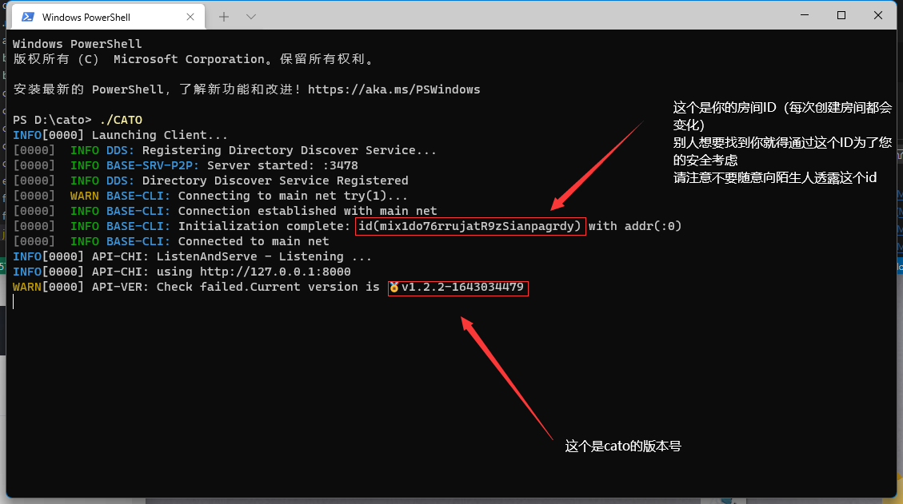

# 使用教程
## 目录页
[[toc]]

## 在开始之前
### id
## 如何入网
### 无凭证入网（**Windoes**）


打开下载cato的目录，

在此界面按住shift后右键

打开**windoes终端**键入
```
./cato
```
如果不出意外你应该会得到以下这个界面



## net – 网络功能


### net add：接入新网络


### net list：当前网络列表


## **ufw – 简易防火墙**


### ufw user:用户防火策略
---

- #### ufw user add :添加屏蔽用户

- #### ufw user del :移除屏蔽用户

- #### ufw user list :屏蔽用户名单
---

### ufw net:网络防火策略
 ---
- ####  ufw net open :添加允许访问地址

- #### ufw net close :移除移除允许访问地址

- #### ufw net whilist :允许访问地址列表

- #### ufw net add :将IP地址添加进黑名单（阻止来自该ip地址的请求）

- #### ufw net del :将IP地址移出黑名单

- #### ufw user blacklist :IP地址黑名单列表

## 加载脚本 (load script)
