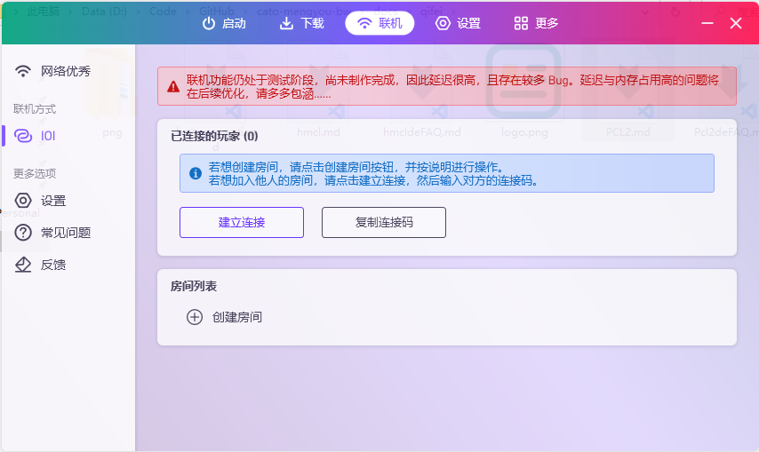

# PCL2联机教程 （尚未编写）
::: danger 注意
文档正在编写中，尚未完成
本教程目前仅适用于 ioi 方式的联机
:::

::: tip 提示
如果你在使用联机过程中遇到任何问题，请先查阅 [常见问题解答](/faq.md)，确认你遇到的问题不在此列后，再依照 [报告问题的正确姿势](/report.md) 中的要求联系开发者。
:::

## 特有名词解释

### NAT 网络类型 
| NAT 网络类型    | ----  |
| ------------- |:-------------:| 
|S         | 公网 | 
| S      | 完全（完全圆锥）      |   
| A | 受限（受限圆锥）      |   
| C     | 端口受限（端口受限圆锥）      |   
| D | 对称      | 
| D      | 对称 + 防火墙     |   
| F | 网络禁止 UDP 协议      | 
| ?      | 检测失败     |   

如果您的类型是 公网 ，您可以直接使用公网IP进行联机。使用公网 IP 联机请查阅网上的资料。

如何改善 NAT 类型为 D 的网络？
您可以参考这篇文章：
【[如何改善 NAT 类型为差的网络？](https://zkitefly.github.io/hmcld/help/launcher/multiplayer-symmetric.html)】

::: warning 注意

在 **F** 环境下您可能**无法进行联机**

在 **D**    环境下您大概率**无法创建房间**，即使创建了房间体验也不会太好，但您能进入类型为 S 的房间

:::

### 猫猫
cato 和 ioi 作品的作者，~~一个强大而可怕的存在。~~

### 这里

[这里](https://www.noin.cn)是 Cato，ioi 作者  猫猫创建的官方社区.
 
你可以在社区里兑换凭证，反馈问题，结交朋友。更多详情请查阅【[社区](/noin/pingzhengjiaocen.md)】板块

## 在使用之前
::: tip 注意
以下是你需要知道的内容
:::

### 房间是什么？

房间是一个游戏集群。

只有您加入联机房间后，才能进行联机。

### 房主是什么？

在每一个房间内，房间的主人叫做房主。

控制存档、玩家等的人就是房主。

### 存档应该放在哪？

存档是由房主决定的。房主需要把存档放进游戏目录内，比如 .minecraft\saves 。

### 玩家由谁控制？

玩家是由房主控制的。

房主可以邀请玩家进入房间、踢出房间等。

## 联机教程
::: danger 注意
请确保你的 PCL2 版本为最新版本，点击进入[ PCL2 官方下载页](https://afdian.net/p/0164034c016c11ebafcb52540025c377)以下载最新版本。

本文使用的 PCL2 版本为 2.2.9
:::
### 主界面

 
### 多人联机界面

### 创建房间

如果您想要让朋友们一起来玩，您可以点击 **创建房间** 按钮。

::: tip 提示
在创建房间之前，请先启动您的游戏！
:::
等待游戏启动后，请进入您的地图，打开游戏菜单（默认按下键盘上的 ESC 打开）。
单击 对局域网开放 。之后，游戏内会提示一串 **端口号** 。
回到 PCL2 联机界面，点击 **创建房间** ，然后输入你的端口号，点击确定。

创建完毕后，点击 **复制连接码** ，将连接码复制到您的粘贴板内。

您可以将这串代码通过社交媒体发送给您的朋友。此时，您这边的工作已经大体完毕。

当您不想玩时，请点击 关闭房间 来关闭这个房间，并点击左侧的关闭（ x ）按钮（悬停在 IOI 按钮上可见），以免 ioi 在后台占用您的资源。

### 加入房间
如果您获得了玩家的连接码，请单击 **加入房间**，在输入框中粘贴您的连接码。点击确定后等待房主允许您加入房间。

房主允许后，此时您可以启动游戏。**在联机游玩过程中，请不要退出 PCL2 ，否则将无法继续联机！**

请使用 **和房主相同的游戏客户端** 。您可以询问房主，获取客户端信息。

进入游戏后，打开 **多人游戏** 界面，点击 **直接连接** ，粘贴（Ctrl+V）地址并确定即可连接。

如果您想退出房间，请点击启动器内断开和房主的连接即可。
