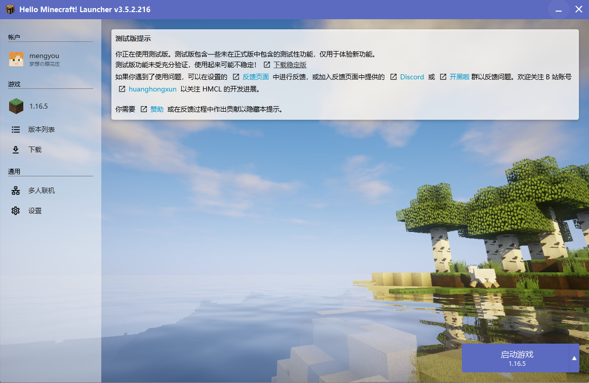
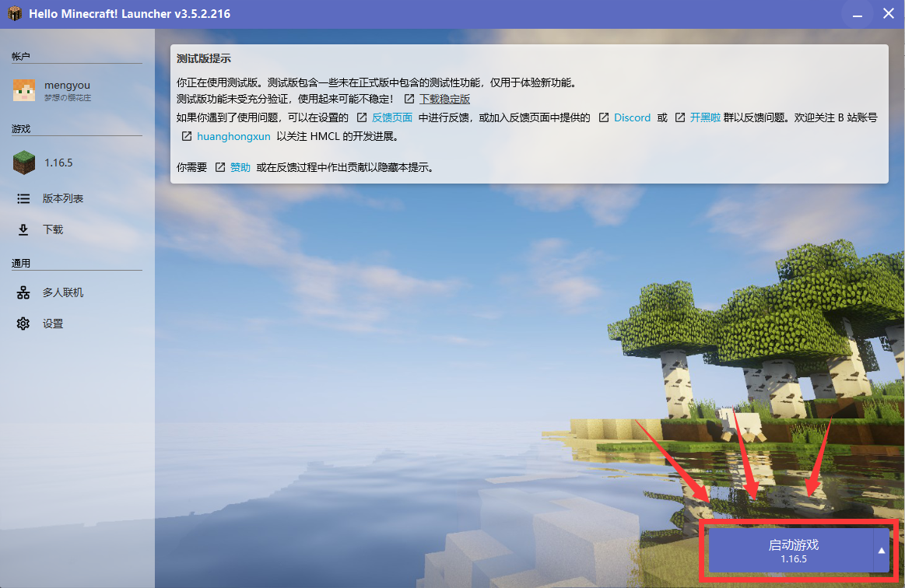
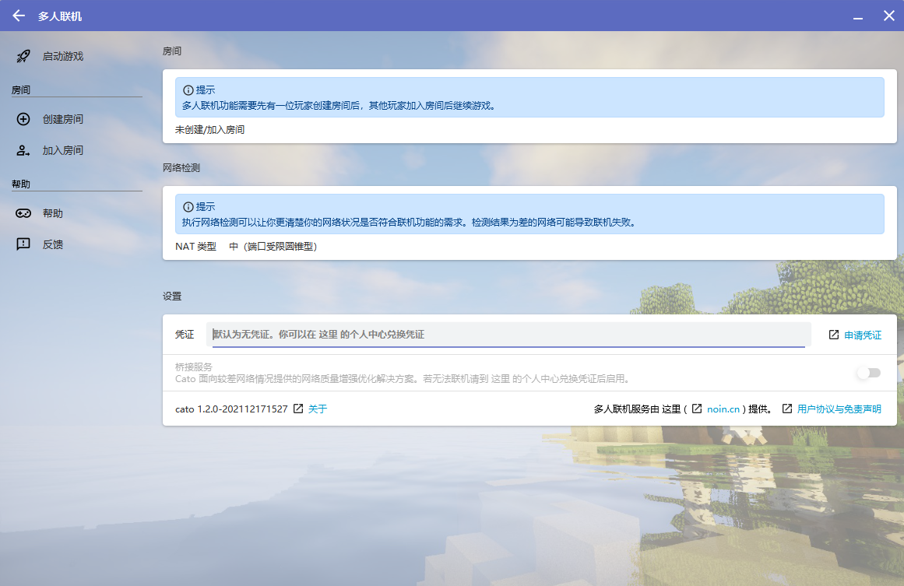
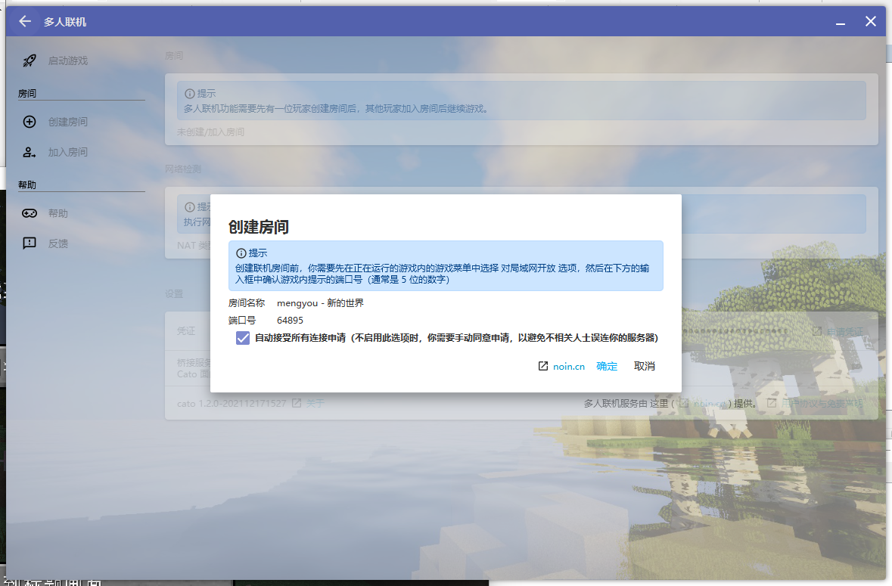

# HMCL联机教程<Badge text="beta" type="warning"/>

第一次写文档，如有错误欢迎指正，我会尽量用通俗的语言写详细点，希望你能看懂。

::: tip 提示
如果你在使用联机过程中遇到任何问题，请先查阅 [常见问题解答](/faq.md)，确认你遇到的问题不在此列后，再依照 [报告问题的正确姿势](/report.md) 中的要求联系开发者。
:::

## 特有名词解释

### NAT 网络类型 
| NAT 网络类型    | ----  |
| ------------- |:-------------:| 
|好         | 公网开放型 | 
| 中      | 完全圆锥型      |   
| 中 | 受限圆锥型      |   
| 中     | 端口受限圆锥型      |   
| 差 | 对称型      | 
| 差      | 对称型+防火墙     |   
| 极差 | 网络禁止 UDP 协议      | 
| 未知类型      | 检测失败     |   

如果您的类型是 好 ，您可以直接使用公网IP进行联机。使用公网IP联机请查阅网上的资料。

::: warning 注意

在 **极差** 环境下您可能**无法进行联机**

在 **差**    环境下您大概率**无法创建房间**，但您能进入类型为 好 的房间

:::

### 凭证

使用桥接服务的身份证，有了他就可以让服务器知道你是否有权使用桥接服务

**注意**：一个凭证只能为一个人使用！

**凭证入网用户是社区网络用户**

社区网络用户能够使用**更多的社区服务资源**

如需兑换凭证，请查阅 [兑换凭证教程](/noin/pingzhengjiaocen.md)。

::: tip Token
Token是服务端生成的一串字符串，以作客户端进行请求的一个令牌，有了他服务器就知道了你是谁，有什么权限，相当与现在的通行证一样，服务器通过这个判断你是否有权使用桥接服务 
:::

### MIX用户
mix用户是指公共网络用户

::: warning 注意

公共网络用户身份(mix)认证的生命周期为半小时，需要更长的存活请申请凭证

也就是说，未使用桥接服务的用户每半个小时会被断开一次。如需长时间保持链接需申请token
:::

### 桥接服务

Cato面向较差网络类型提供的网络质量增强优化解决方案。

### 猫猫
cato和ioi作品的作者，~~一个强大而可怕的存在。~~

### 这里

[这里](https://www.noin.cn)是Cato，ioi作者  猫猫创建的官方社区.
 
你可以在社区里兑换凭证，反馈问题，结交朋友。更多详情请查阅【[社区](/noin/pingzhengjiaocen.md)】板块

## 在使用之前
::: tip 注意
以下是你需要知道的内容
:::

### 房间是什么？
房间就是一个游戏集群。

只有您加入联机房间后，才能进行联机。

### 房主是什么？

在每一个房间内，房间的主人叫做房主。

控制存档、玩家等的人就是房主。

### 存档应该放在哪？

存档是由房主决定的。

房主需要把存档放进游戏目录内。

比如 .minecraft\saves 。

### 玩家由谁控制？

玩家是由房主控制的。

房主可以邀请玩家进入房间、踢出房间等。

## 联机教程
::: danger 注意
请确保你的hmcl版本为最新版本，点击进入[HMCL官方下载页](https://hmcl.huangyuhui.net/download/)检查自己版本是否为最新

本文使用hmcl的版本为 3.5.2.216
:::
### 主界面

### 启动游戏
#### 单击此处后，您将会启动当前主界面所选游戏。

#### HMCL 此时不会关闭界面。

 
### 多人联机界面

### 创建房间

如果您想要让朋友们一起来玩，您可以点击此处创建房间。

::: tip 提示
在创建房间之前，请先启动您的游戏！
:::
等待游戏启动后，请进入您的地图，打开游戏菜单（默认按下键盘上的 ESC 打开）。
单击 对局域网开放 。
设置好所有内容后，点击确认按钮后，将会出现对局域网开放成功的信息。（如下图红色边框内的信息）

此时，请回到 HMCL 多人联机界面。点击 创建房间 ，您将看到您的局域网游戏已经被正确识别。

单击确认按钮，即可创建房间。

::: tip 提示

使用桥接模式的玩家请务必在凭证处填写你获取的[凭证](./hmcl.html#凭证)，并开启桥接模式开关
:::
创建完毕后，点击 **复制邀请码** ，将邀请码复制到您的粘贴板内。

您可以将这串代码粘贴给您的朋友，此时，您这边的工作已经大体完毕。

当玩家想要加入您的房间时，将会弹出确认信息。

确认后，玩家使用相同版本进入游戏，打开 **多人游戏** 界面，等待少许时间，即可在下方 **局域网联机** 板块找到您的房间。

当您不想玩时，请点击 关闭房间 来关闭这个房间，以免 Cato 在后台占用您的资源。

### 加入房间
如果您获得了玩家的邀请码，请单击 **加入房间**，在输入框中粘贴您的邀请码。点击确定后等待房主允许您加入房间。

房主允许后，此时您可以启动游戏。**在联机游玩过程中，请不要退出 HMCL，否则将无法继续联机！**

请使用**和房主相同的游戏客户端**。您可以询问房主，获取客户端信息。

进入游戏后，打开 **多人游戏** 界面。等待少许时间后，即可在下方 **局域网联机** 区域找到房主的房间。

点击 加入服务器 后即可游玩。

如果您想退出房间，请点击启动器内 **退出房间** 即可
