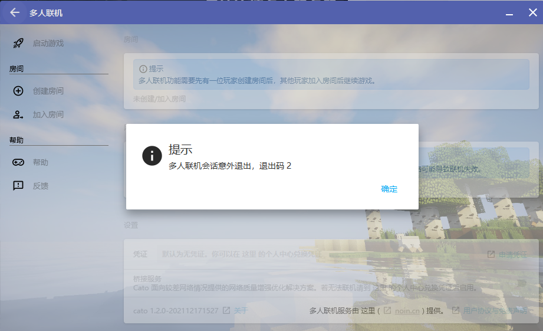
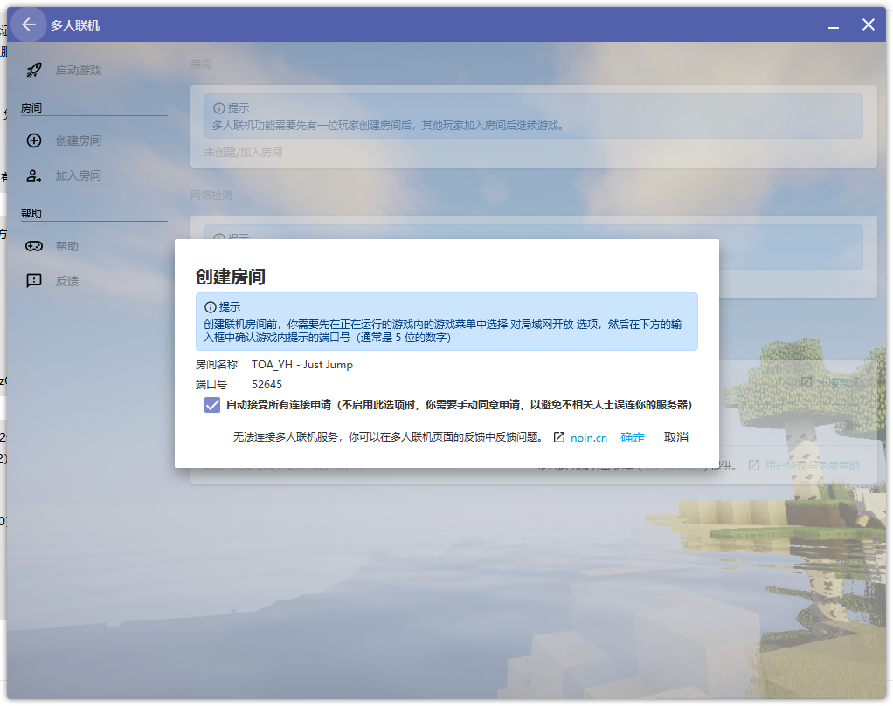
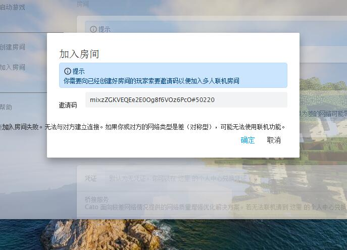
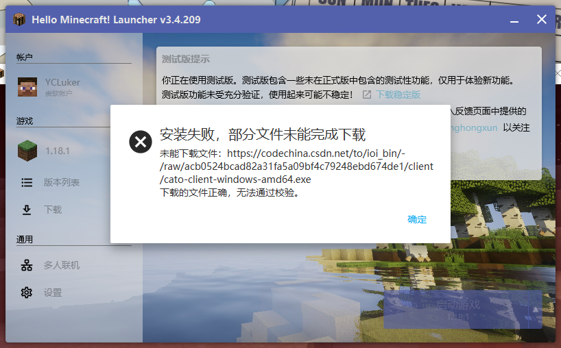

# HMCL常见问题

## HMCL退出码2

请自行去HMCL启动器官网下载**最新的测试版本**[HMCL官方下载页](https://hmcl.huangyuhui.net/download/)

## 无法连接多人联机服务，你可以在多人联机页面的反馈中反馈问题

鉴权服务器被人占满，请等待每个半点，鉴权服务器会自动刷新一次。如果没有耐心并且有闲钱的可以考虑购买联机凭证，不受鉴权服务器影响。

## 加入房间失败，无法与对方建立链接

1.请检查房主和你的HMCL版本是否一致

2.可尝试使用凭证，开启桥接服务，普通的ptp无法联机，因为nat等级过差

::: warning 注意

在 **极差** 环境下您可能**无法进行联机**

在 **差**    环境下您大概率**无法创建房间**，但您能进入类型为 好 的房间

:::
## 安装失败，部分文件无法下载

重启hmcl，关闭防火墙或杀毒软件，添加cato信任。

## 创建联机房间失败，你的凭证可能无法正常工作，你可以使用空凭证再试

请先检查你的凭证是否填写**错误**或**过期**

请联系**在线管理员**询问鉴权服务器是否正常工作，或者耐心等待十分钟。

